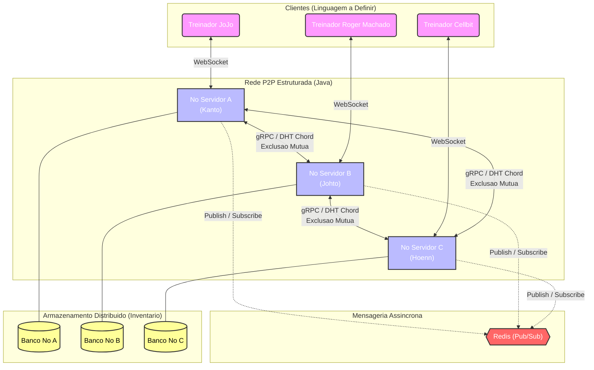

 # Sistema Distribuído de Coleção e Troca de Pokémon (NFTs)

## Sobre o Projeto

O sistema implementa uma infraestrutura distribuída inspirada na dinâmica de colecionismo de Pokémon e seu objetivo principal é construir uma arquitetura descentralizada e tolerante a falhas onde cada Pokémon atua como um ativo digital único (NFT) com atributos variáveis (IVs). Os usuários podem interagir em um chat global em tempo real, competir por capturas (spawns aleatórios) e realizar trocas (P2P) de forma segura através do "PC", um sistema de armazenamento persistente e distribuído.

---

## Arquitetura de Sistemas Distribuídos

Para garantir que o sistema não dependa de um servidor centralizado sujeito a ponto único de falha, a arquitetura foi dividida em dois grandes subsistemas, aplicando os principais conceitos da literatura de Sistemas Distribuídos:

### 1. Comunicação Assíncrona: Chat Global e Spawns (Pub/Sub)
A dinâmica de tempo real do jogo foi isolada do núcleo transacional pesado.
* **Middleware:** Utilizamos o **Redis Pub/Sub** para gerenciar a comunicação.
* **Funcionamento:** Quando a lógica do backend decide gerar um Pokémon selvagem, o evento é publicado em um tópico global. Todos os nós da rede (e por consequência, os clientes conectados a eles) recebem a notificação simultaneamente e de forma ordenada. Isso garante alta performance e baixo acoplamento entre os serviços.

### 2. Nomeação e Armazenamento: O "PC" (P2P Estruturado)
O inventário dos jogadores não fica em um banco de dados relacional clássico.
* **Modelo:** Implementação de uma Tabela de Hash Distribuída (**DHT**) baseada no algoritmo **Chord**.
* **Funcionamento:** A rede forma um anel lógico. Cada Pokémon capturado recebe um identificador único (Hash) e é armazenado no nó responsável por aquele segmento do anel. Isso resolve o problema de Nomeação e garante que a busca por um ativo ocorra em complexidade logarítmica, distribuindo a carga de armazenamento entre as máquinas.

### 3. Coordenação e Exclusão Mútua: Capturas e Trocas
As transações críticas do jogo exigem garantias rígidas de consistência.
* **Concorrência de Captura:** Se múltiplos jogadores tentarem capturar o mesmo Pokémon gerado no chat no mesmo milissegundo, o sistema utiliza algoritmos de **Exclusão Mútua Distribuída** (Distributed Locks) para garantir a atomicidade da operação. Apenas a primeira requisição adquire o bloqueio, evitando a duplicação de ativos.
* **Trocas P2P (Trade):** Durante a troca direta de ativos entre dois jogadores em nós diferentes, o sistema coordena uma transação segura. Caso ocorra uma queda de rede em qualquer um dos nós durante o processo, a transação sofre *rollback*, prevenindo a clonagem ou perda de Pokémon.

---

## Arquitetura do Sistema

---

## Especificação de Mensagens e Protocolos

Para suportar a arquitetura descentralizada, o sistema utiliza diferentes protocolos de comunicação dependendo da necessidade de consistência ou velocidade da operação. Abaixo estão detalhados os "payloads" (conteúdos) das mensagens trocadas no sistema, divididas por módulos.

---

### 1. Módulo PC (Armazenamento Distribuído - DHT)
Gerencia o inventário persistente dos jogadores utilizando uma rede P2P estruturada (Chord).

**Comunicação Cliente ➔ Servidor (Visualização):**
* `Solicitar Inventario`: `<ID_Treinador>`
* `Resposta Inventario`: `<Lista [ID_Pokemon, Especie, Atributos], Status>`

**Comunicação Servidor ➔ Servidor (Interna P2P):**
* `DHT Lookup`: `<Hash(ID_Treinador)>` 
  > *Descrição: O nó local roteia essa mensagem pelo anel lógico (Chord) para descobrir qual IP guarda a caixa do jogador solicitado.*
* `Transferencia Posse (Update)`: `<ID_Pokemon, Novo_ID_Treinador>` 
  > *Descrição: Atualiza o dono do ativo digital no banco de dados distribuído após uma troca bem-sucedida.*

---

### 2. Módulo de Troca (Consenso e Exclusão Mútua)
Gerencia a negociação P2P direta entre dois treinadores. Utiliza um modelo simplificado de *Two-Phase Commit* (Commit de Duas Fases) para evitar clonagem ou perda de Pokémon caso a rede falhe.

**Comunicação Cliente ➔ Servidor (Interação do Usuário):**
* `Enviar Solicitacao Troca`: `<ID_Treinador_Origem, ID_Treinador_Destino>`
* `Resposta Solicitacao`: `<ID_Solicitacao, Status_Aceite>`
* `Selecionar Pokemon`: `<ID_Solicitacao, ID_Pokemon>`
* `Confirmar Troca (Ready)`: `<ID_Solicitacao, ID_Treinador>`

**Comunicação Servidor ➔ Servidor (Transação Distribuída):**
* `Acquire Lock Pokemon`: `<ID_Pokemon, ID_Solicitacao>` 
  > *Descrição: Aplica exclusão mútua. Bloqueia o Pokémon no banco de dados para impedir que ele seja transferido ou capturado por outro processo concorrente durante a negociação.*
* `Commit Trade`: `<ID_Solicitacao, Transacao_Hash>` 
  > *Descrição: Efetiva a troca atômica nos dois nós simultaneamente e libera os Locks.*
* `Rollback / Cancelar Troca`: `<ID_Solicitacao>` 
  > *Descrição: Aborta a operação e libera os Locks caso um dos nós caia (Time-out) ou um usuário recuse.*

---

### 3. Módulo de Chat Global (Pub/Sub)
Gerencia a comunicação assíncrona em tempo real utilizando Redis Pub/Sub.

**Mensagens do Tópico Global:**
* `Enviar Mensagem`: `<ID_Treinador, String_Mensagem, Timestamp_Local>`
  > *Descrição: O uso do Timestamp garante a ordenação causal das mensagens na tela dos clientes, mitigando os atrasos de rede.*

---

### 4. Módulo de Spawn e Captura (Coordenação de Concorrência)
Gerencia a geração procedural de recursos e a resolução de condições de corrida (vários jogadores tentando capturar o mesmo Pokémon no mesmo milissegundo).

**Comunicação Servidor (Líder) ➔ Pub/Sub (Anúncios):**
* `Spawnar Pokemon`: `<UUID_Pokemon, Especie, Lista_Atributos_IVs, Timestamp_Spawn>`
  > *Descrição: Os atributos imutáveis são gerados no momento do spawn pelo nó que atua como Coordenador.*
* `Anuncio Captura`: `<UUID_Pokemon, ID_Treinador, Nome_Treinador>`

**Comunicação Cliente ➔ Servidor (Ação do Jogador):**
* `Jogar Pokebola`: `<ID_Treinador, UUID_Pokemon, Timestamp_Tentativa>`
  > *Descrição: O Timestamp da tentativa resolve desempates caso duas requisições cheguem ao servidor no mesmo ciclo de processamento.*

**Comunicação Servidor ➔ Cliente (Resoluções de Captura):**
* `Confirmacao Captura`: `<ID_Treinador, UUID_Pokemon>`
* `Falha na Captura`: `<Motivo, UUID_Pokemon>`
  * *Motivo 1: `FALHA_SORTE` (O RNG determinou que o Pokémon escapou da pokébola).*
  * *Motivo 2: `FALHA_DESPAWN` (O tempo do Pokémon no mapa expirou).*
  * *Motivo 3: `FALHA_JA_CAPTURADO` (Outro jogador adquiriu o Lock do banco de dados antes).*
 
## Nomeação e Processos

## Tecnologias Utilizadas

* **Backend / Nós P2P:** Java 
* **Mensageria / Tempo Real:** Redis (Pub/Sub).
* **Frontend:** A definir
* **Comunicação entre Nós:** Sockets / gRPC.

---

## Como Executar o Projeto

---

## Equipe de Desenvolvimento
Projeto desenvolvido por:

* **André Portela** -
* **Davi Oliveira** -  
* **Eduardo Almeida** - 
* **Júlio Arroio** -

