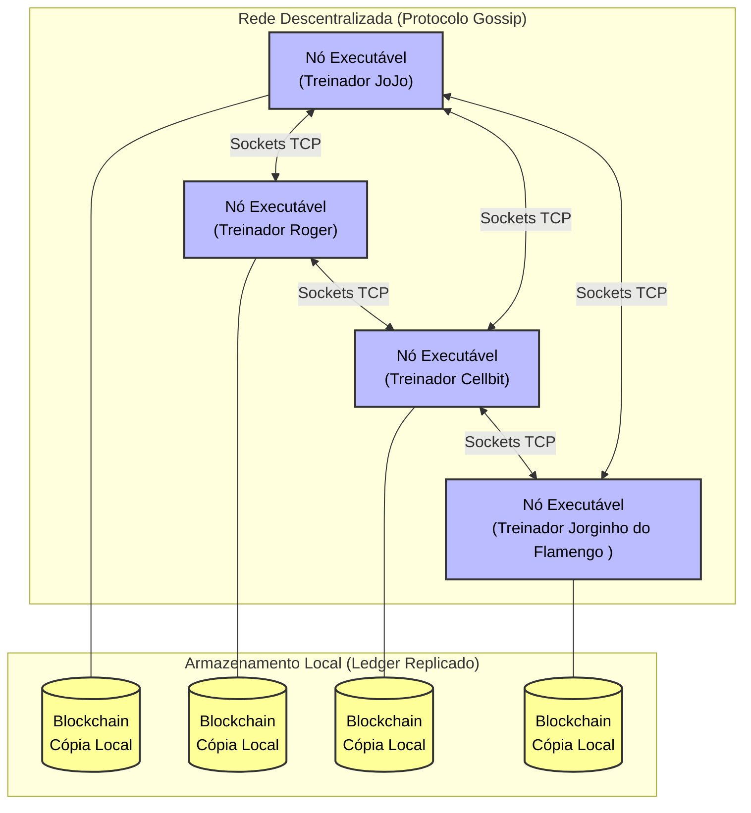
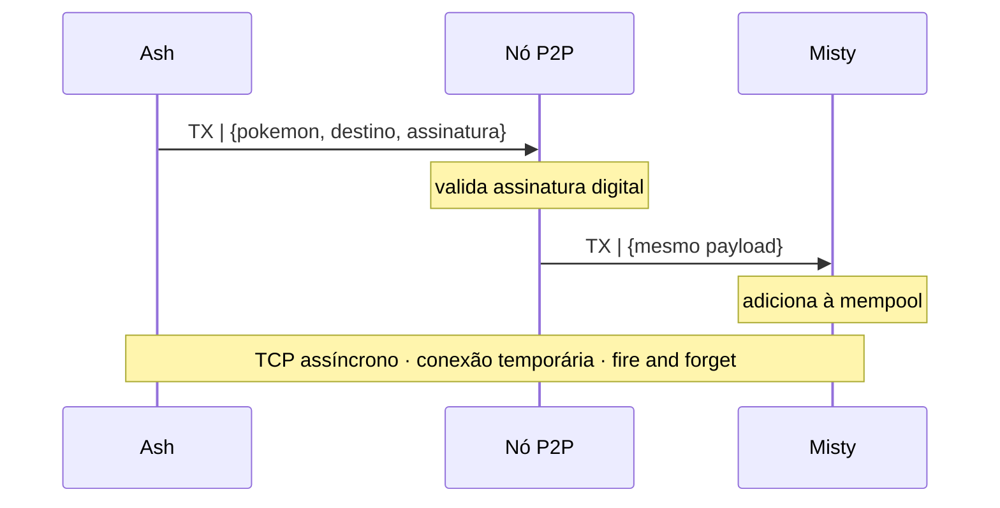
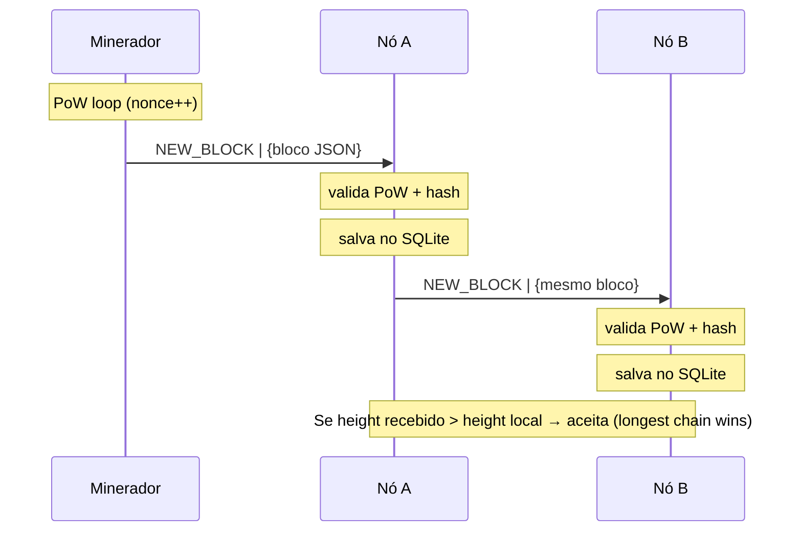
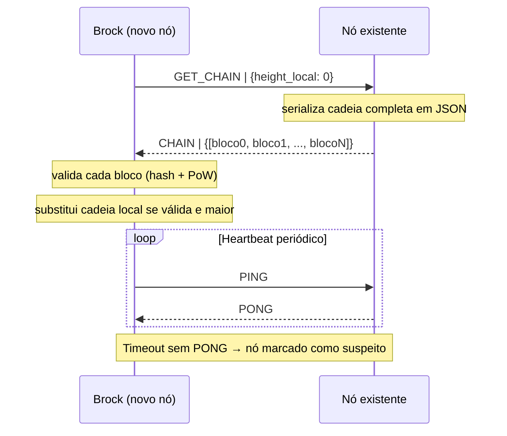

# Sistema Distribuído de Coleção e Troca de Pokémon (NFTs)

## Sobre o Projeto
O sistema implementa uma infraestrutura distribuída inspirada na dinâmica de colecionismo de Pokémon. Seu objetivo principal é construir uma plataforma **100% descentralizada (Pure P2P)**, baseada em conceitos de Blockchain, onde cada Pokémon atua como um ativo digital criptográfico único (NFT) com atributos variáveis (IVs). 

Ao contrário de sistemas tradicionais, não há servidores centrais validando o jogo. Os próprios jogadores executam o aplicativo (atuando como Nós Completos na rede P2P), mantendo cópias idênticas do histórico do jogo, realizando trocas diretas (*Trustless*) e validando as ações da rede através de um algoritmo de Consenso Distribuído.

---

## Arquitetura do Sistema: O Modelo P2P Puro (Blockchain)

Para garantir que o sistema seja imune a fraudes, manipulações de clientes e pontos únicos de falha, a topologia adota uma **Arquitetura Peer-to-Peer Pura**. A separação entre "cliente" e "servidor" deixa de existir.

### 1. Aplicação Executável (Nó Completo / Full Node)
Cada jogador instala e roda a aplicação localmente no seu sistema operacional. Essa aplicação atua simultaneamente como a interface gráfica do jogo e como o motor de rede que se conecta diretamente aos endereços IP dos outros jogadores.

### 2. O Livro-Razão Distribuído (Ledger Replicado)
O inventário não é particionado entre máquinas. Em vez de uma DHT, utilizamos o conceito de **Ledger (Blockchain)**. Todo nó da rede possui uma cópia integral de um banco de dados local contendo o histórico de todos os Pokémon gerados e de quem são os donos atuais.

### 3. Consenso Distribuído (Substituindo a Exclusão Mútua Clássica)
Para evitar o problema de clonagem (*Double Spending*) em capturas e trocas simultâneas, não utilizamos *Locks* centralizados. As ações dos jogadores são agrupadas em Blocos (Blocks) e validadas pela rede através de um mecanismo de Consenso. Apenas ações criptograficamente válidas e não conflitantes são efetivadas no Livro-Razão.

### 4. Mensageria Descentralizada (Gossip Protocol)
Sem um servidor Redis (Pub/Sub) para espalhar mensagens de chat ou eventos, a rede utiliza o protocolo de fofoca (*Gossip Protocol*). Quando um nó envia uma mensagem ou propõe uma transação de troca, ele a propaga para seus vizinhos conhecidos, que a retransmitem até que a rede inteira seja notificada em instantes.

---

## Diagrama da Arquitetura P2P Pura

# Especificação de Mensagens e Protocolos

Nesta arquitetura, todas as mensagens trafegam diretamente entre os Nós pares da rede (Node-to-Node). O conteúdo ("payload") é essencial para validar as regras criptográficas do jogo.

## 1. Módulo PC (O Livro-Razão)

Como todos os nós possuem uma cópia do banco de dados completo, não há tráfego de rede para visualizar inventários. A busca por um Pokémon ou pelos ativos de um treinador ocorre inteiramente na memória/disco local do próprio jogador, com complexidade de tempo constante O(1) ou através de indexações locais.

## 2. Módulo de Transações (Trocas e Capturas)

A negociação P2P direta adota o modelo de submissão à Mempool (Piscina de Transações), aguardando a validação da rede.

**Anunciar Transacao:**  
`<Chave_Publica_Origem, Chave_Publica_Destino, ID_Pokemon, Assinatura_Digital>`

**Descrição:** O jogador assina a intenção de trocar/capturar usando sua chave privada. O Gossip Protocol espalha isso para a rede, que valida se ele realmente é o dono do ativo antes de incluí-lo no próximo bloco.

**Propor Novo Bloco:**  
`<Hash_Bloco_Anterior, Lista_Transacoes, Assinatura_No_Validador>`

**Descrição:** Mensagem enviada pelo Nó que venceu o Consenso do turno, ordenando as trocas e capturas daquele momento.

## 3. Módulo de Chat Global (Gossip Protocol)

**Gossip Message:**  
`<ID_Mensagem, Chave_Publica_Treinador, String_Mensagem, Timestamp>`

**Descrição:** Mensagem propagada epidemicamente. Cada nó possui um filtro de cache para garantir que não exiba a mesma mensagem `ID_Mensagem` duas vezes na tela do jogador.

## Definição de diagramas de sequência

**Diagrama 1 — Troca de Pokémon (TX)**

**Diagrama 2 — Mineração e propagação de bloco (NEW_BLOCK)**

**Diagrama 3 — Sync inicial de novo nó (GET_CHAIN)**

---

# Nomeação (Naming)

## 1. Quais recursos precisam ser nomeados/identificados?

- **Treinadores (Jogadores):** Utilizam pares de chaves criptográficas assíncronas. O nome público do jogador na rede é derivado de sua Chave Pública (o equivalente ao endereço de uma carteira de criptomoedas).

- **Ativos Digitais (Pokémon):** Recebem um identificador único baseado no Hash SHA-256 das informações de sua criação (Espécie + IVs + Timestamp de Geração), tornando-os matematicamente únicos.

## 2. Qual esquema de nomeação?

Utilizaremos o esquema de **Nomeação Plana (Flat Naming)**.

## 3. Dado o esquema, qual mecanismo de resolução de nomes?

Diferente de sistemas híbridos com DHT, a resolução de nomes na nossa rede blockchain é **local**. Como cada nó armazena uma cópia integral do Livro-Razão, descobrir "quem é o dono do Pikachu XYZ" requer apenas uma simples varredura (`SELECT`) no banco de dados local do próprio executável.

---

# Processos 

## 1. Faz sentido usar threads?

**Sim, fundamental.** O executável de cada jogador roda em Múltiplas Threads:
- uma dedicada à renderização da Interface Gráfica,
- uma (ou mais) gerenciando as conexões de Sockets (escutando vizinhos no protocolo Gossip),
- e uma dedicada puramente à validação criptográfica de novas transações em background.

## 2. Servidores Stateful ou Stateless?

Todos os Nós são **Stateful**. Eles mantêm na memória e no disco o estado da rede inteira (a cadeia de blocos desde o "Bloco Gênesis").

## 3. Faz sentido usar técnicas de virtualização?

A virtualização (Docker) será usada **unicamente em ambiente de desenvolvimento/testes** para instanciar múltiplos nós rapidamente em uma máquina. Em produção, a aplicação é projetada para rodar de forma nativa e bare-metal (como um .exe ou .jar) para explorar o máximo das interfaces de rede dos sistemas operacionais dos jogadores.

---

# Coordenação (Coordination)

## 1. Sincronização: Relógio Real ou Lógico?

Utilizamos o **Tempo Lógico**, mas atrelado à altura da cadeia de blocos (Block Height). A "hora oficial" do jogo não é medida em milissegundos, mas sim em qual bloco as ações foram confirmadas. Se a ação A está no bloco 100 e a ação B no bloco 101, a rede inteira concorda, causalmente, que A aconteceu antes de B.

## 2. Será necessário empregar exclusão mútua (distribuída)?

**Não** no formato tradicional (Locks). O problema de "dupla captura" ou clonagem é resolvido pelo **Algoritmo de Consenso**. Se dois jogadores enviarem transações tentando capturar o mesmo Snorlax, ambas irão para a Mempool. O nó responsável por fechar o próximo bloco escolherá apenas uma (geralmente a primeira que recebeu), rejeitando matematicamente a segunda, pois o estado do Snorlax mudará na blockchain.

## 3. Qual Algoritmo de Eleição ou Consenso?

A validação do estado do jogo utilizará um algoritmo de consenso adaptado, como **Prova de Autoridade (PoA)** ou um **Round-Robin** simples entre os pares ativos, onde os nós se alternam no direito de validar o próximo bloco e gerar (spawnar) novos Pokémon no mapa de forma pseudoaleatória baseada no hash do bloco anterior.

## 4. Como a mensageria será implementada?

**Gossip Protocol**: Uma mensagem gerada no Nó A é repassada para os vizinhos B e C, que a repassam adiante, inundando a rede de forma descentralizada.

---

## Tolerância a Falhas

### 1. Disponibilidade vs. Confiabilidade
Para o PokeEach, a **Disponibilidade** é prioritária.
* **Motivo:** Em uma rede P2P descentralizada, é aceitável que um nó fique temporariamente inconsistente (sem o último bloco) operando localmente. Não é aceitável congelar a rede inteira aguardando sincronização global.
* **Métricas:** Foco em maximizar o $MTTF$ e mitigar o impacto do $MTTR$, tolerando janelas curtas de inconsistência eventual.

---

### 2. Classes de Falhas e Tolerância
O sistema adota uma classificação **fail-noisy** (falhas de parada eventualmente detectáveis via timeout).

| Tipo de Falha (Slide) | Tolerada? | Manifestação no PokeEach |
| :--- | :---: | :--- |
| **Parada (Crash)** | ✅ Sim | Um nó desliga abruptamente durante a mineração ou transmissão. |
| **Omissão de TX / RX** | ✅ Sim | Sockets falham ao propagar uma transação (`mempool`) ou bloco para um vizinho. |
| **Temporal** | ⚠️ Parcial | Atrasos na propagação de rede são resolvidos pela regra da maior cadeia (*longest chain*). |
| **Resposta / Valor** | ❌ Não | Hashes inválidos são rejeitados; o sistema não possui redundância de cálculo para correção. |
| **Arbitrária (Bizantina)** | ❌ Não | Não há implementação de algoritmos de tolerância bizantina (BFT). |

---

### 3. Redundância Física (Métricas de Suporte)
Como toleramos apenas falhas de **crash**, a regra de processos falhantes segue a proporção $k+1$ réplicas para tolerar $k$ falhas:
* **Com $N$ nós:** A rede tolera até **$N-1$ crashes**. 
* Qualquer réplica sobrevivente mantém a integridade histórica completa da blockchain através de seu banco de dados local SQLite, permitindo que a rede continue operando e minerando sem um número mínimo fixo de nós.

---

### 4. Estratégia e Protocolo de Detecção de Falhas
* **Modelo:** Sistema parcialmente síncrono, operando com **Heartbeat passivo e Timeout adaptativo**.
* **Mecânica:** O `P2PNode` envia pacotes periódicos (`PING`). Se o par não responder (`PONG`) dentro do timeout $t$, ele se torna suspeito e é removido da lista ativa de broadcast. O nó é readicionado imediatamente ao enviar qualquer mensagem válida subsequente.

---

### 5. O Teorema CAP e o PokeEach
O PokeEach é categorizado estritamente como um sistema **AP (Disponibilidade e Tolerância ao Particionamento)**.
* **Justificativa:** Havendo uma partição de rede, os nós isolados continuam minerando e aceitando trocas localmente (mantendo o sistema disponível). 
* A consistência forte ($C$) é sacrificada temporariamente. Quando a comunicação é restabelecida, a consistência converge através do mecanismo de **Consistência Sequencial Eventual** ditada pelo algoritmo de *Proof of Work*.

---

### 6. Estratégia de Recuperação de Falhas
Adotamos a **Recuperação para Frente (Forward Error Recovery)** baseada no histórico de blocos:
* **Recuperação pós-crash:** Ao inicializar, o nó executa um handshake de sincronização (`GET_CHAIN`), identifica o atraso na altura do bloco local (`height`), requisita os blocos faltantes e avança para o estado válido mais recente.
* **Atomicidade em Disco:** O armazenamento na camada `storage` utiliza `conn.setAutoCommit(false)` no SQLite. Isso garante que a persistência de novos blocos (`saveBlock`) seja inteiramente gravada ou descartada, agindo como o *checkpoint* natural do sistema.

#  Justificativa da Topologia: Por que P2P Puro e Executável?

A transição para um modelo 100% descentralizado e a obrigatoriedade de um cliente executável (Desktop Application) atendem às restrições de segurança exigidas por uma rede de NFTs:

- Tecnologias web (como o React no navegador) não possuem permissão do sistema operacional para atuar como verdadeiros servidores (escutar portas TCP e coordenar rotas diretas livremente). Um aplicativo executável permite manipular ServerSockets e criar uma malha P2P real, sem a necessidade de um servidor de sinalização intermediário.

-  Diferente de um backend que dita as regras, aqui as regras estão imutáveis no protocolo. Nenhum nó confia no outro. Se um treinador alterar o código do seu executável para roubar um Pokémon, a transação conterá um hash inválido que será sumariamente rejeitado pelo consenso do resto da rede.

- O inventário de ativos (Ledger) não sofre o risco de ser perdido caso o servidor de um banco de dados tradicional saia do ar, pois seu histórico reside em cópias absolutas no disco rígido de todos os jogadores ativos.

---

# Tecnologias Utilizadas

- **Plataforma / Executáveis:** Java (ou Node.js)
- **Persistência Local (Ledger):** SQLite embutido
- **Comunicação entre Nós (Gossip/P2P):** WebSockets Puros ou TCP Sockets
- **Criptografia:** SHA-256 (Hashes) e RSA/ECDSA (Assinaturas Digitais)

---

# Equipe de Desenvolvimento

Projeto desenvolvido por:

- André Portela
- Davi Oliveira
- Eduardo Almeida
- Júlio Arroio
