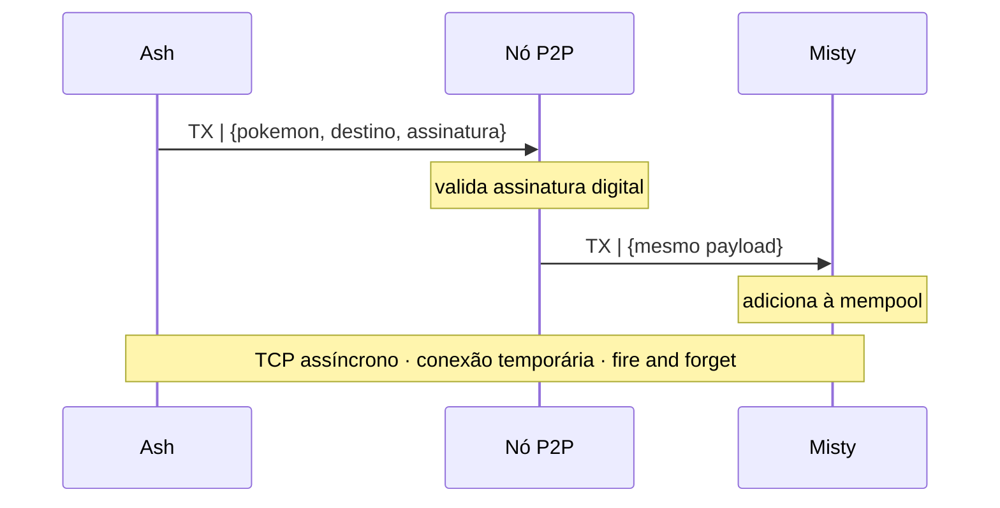
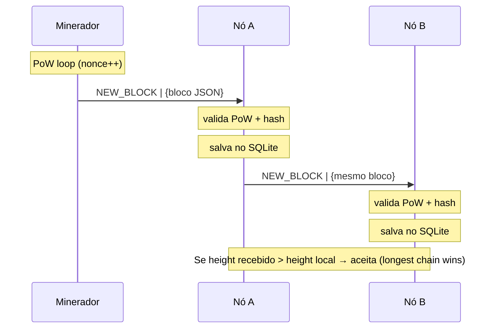
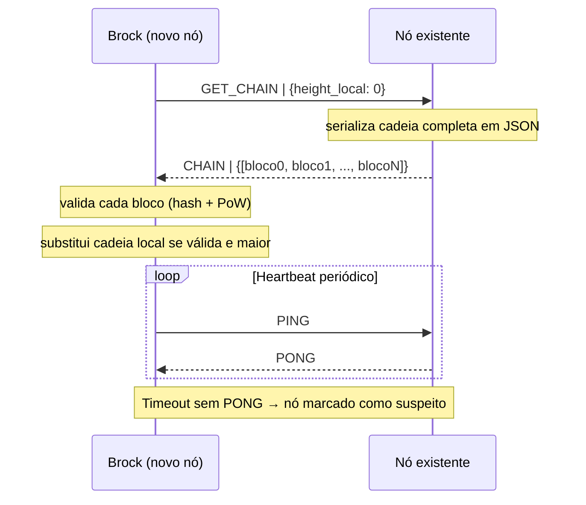

# Sistema Distribuído de Coleção e Troca de Pokémon (NFTs)
 
## Sobre o Projeto
 
O sistema implementa uma infraestrutura distribuída inspirada na dinâmica de colecionismo de Pokémon. Seu objetivo principal é construir uma plataforma **100% descentralizada (Pure P2P)**, baseada em conceitos de Blockchain, onde cada Pokémon atua como um ativo digital criptográfico único (NFT) com atributos variáveis (IVs).
 
Ao contrário de sistemas tradicionais, não há servidores centrais validando o jogo. Os próprios jogadores executam o aplicativo (atuando como Nós Completos na rede P2P), mantendo cópias idênticas do histórico do jogo, realizando trocas diretas (*Trustless*) e validando as ações da rede através de um algoritmo de Consenso Distribuído.
 
---
 
## Arquitetura
 
### Forneça um desenho da arquitetura
 

 
### Dos modelos estudados, algum se encaixa?
 
O sistema adota a topologia **Peer-to-Peer Pura Não Estruturada**. Não há hierarquia, supernós ou tabelas de roteamento (DHT). Cada nó conhece apenas seus vizinhos diretos (lista de IPs configurada manualmente) e propaga mensagens por inundação epidêmica (Gossip). Não se encaixa em arquitetura em camadas (há separação interna de pacotes, mas todos os nós são simétricos), nem em microsserviços (não há decomposição funcional entre processos distintos), nem em Pub/Sub clássico (não há broker central — o Gossip é o próprio mecanismo de difusão).
 
### Arquitetura de software interna
 
O projeto é organizado nos seguintes pacotes Java:
 
| Pacote | Responsabilidade |
|:---|:---|
| `dsid.app` | Ponto de entrada (`Main`) e simulação do fluxo completo |
| `dsid.core` | Entidades do domínio: `Block`, `Transaction`, `Blockchain` |
| `dsid.crypto` | Criptografia: `HashUtils`, `Wallet`, `KeyPairManager` |
| `dsid.service` | Lógica de mineração: `MiningService` (PoW + sorteio de Pokémon) |
| `dsid.storage` | Persistência SQLite: `LedgerRepository`, `SQLiteConnection` |
| `dsid.network` | Rede P2P: `P2PNode`, `SocketServer`, `SocketClient`, `MessageParser` |
| `dsid.utils` | Utilitários de serialização de chaves: `KeyUtils` |
 
### Como o sistema será testado?
 
O sistema será validado em três etapas progressivas:
 
1. **Ambiente Local Mononó:** Testes unitários focados na validação criptográfica, verificação de assinaturas digitais de transações e cálculo do loop de mineração (Proof of Work).
2. **Simulação de Rede Local (Múltiplas Portas):** Execução de múltiplas instâncias do .jar` na mesma máquina física, mapeando portas TCP distintas (ex: `8081`, `8082`, `8083`) para simular concorrência na Mempool, ocorrência de forks locais e convergência do consenso.
3. **Ambiente Concorrente Virtualizado:** Uso de containers Docker para instanciar nós isolados, limitando propositalmente a largura de banda e injetando latência, garantindo o disparo correto das rotas de Heartbeat e o comportamento resiliente sob partições de rede.
### Faz sentido usar algum tipo de middleware?
 
**Não para o núcleo do consenso.** A adoção de middlewares tradicionais (CORBA, Java RMI, gRPC) ou de mensageria orientada a filas (RabbitMQ, Kafka) introduziria dependência centralizada que violaria a premissa Pure P2P. A camada de rede exige controle total sobre o fluxo de pacotes e conexões simétricas, o que justifica o desenvolvimento do protocolo de mensagens diretamente sobre a API nativa de Sockets TCP do Java (`ServerSocket` e `Socket`).
 
---
 
## Comunicação
 
### Qual o tipo de comunicação utilizado?
 
- **Protocolo de transporte:** TCP, garante entrega ordenada, essencial para integridade dos blocos.
- **Modelo:** Assíncrono e *fire-and-forget*, o nó emissor não bloqueia aguardando resposta após enviar `TX` ou `NEW_BLOCK`. A exceção é o fluxo `GET_CHAIN`, onde o nó novo aguarda a cadeia completa antes de operar.
- **Conexões:** Temporárias, o `SocketClient` abre a conexão, envia a mensagem e fecha imediatamente, liberando recursos de rede.
- **Multicast:** Implementado por software no método `broadcast()` do `P2PNode`, que itera sobre a lista `vizinhosConhecidos` e envia a mesma mensagem via TCP para cada par. Não utiliza UDP multicast de rede, escolha deliberada para garantir entrega confiável.
### Quais são os tipos de mensagens e seus formatos?
 
Todas as mensagens seguem o formato `COMANDO|payload_JSON`, com separador pipe (`|`) e payload serializado via Google Gson.
 
| Comando | Direção | Payload | Descrição |
|:---|:---|:---|:---|
| `TX` | Nó → vizinhos | `{transactionId, remetente, destinatario, idPokemon, timestamp, assinatura}` | Propaga transação de troca à mempool da rede |
| `NEW_BLOCK` | Minerador → vizinhos | `{height, hash, previousHash, timestamp, nonce, minerKey, rewardPokemon, transactions[]}` | Propaga bloco recém-minerado |
| `GET_CHAIN` | Novo nó → vizinho | `{heightLocal: N}` | Solicita cadeia completa a partir do bloco N |
| `CHAIN` | Vizinho → novo nó | `{blocks: [...]}` | Resposta com a cadeia serializada completa |
| `PING` | Nó → vizinho | `{}` | Heartbeat periódico para detecção de falhas |
| `PONG` | Vizinho → nó | `{}` | Resposta ao heartbeat confirmando que o nó está ativo |
 
### Definição de diagramas de sequência
 
**Diagrama 1 — Troca de Pokémon (TX)**

 
**Diagrama 2 — Mineração e propagação de bloco (NEW_BLOCK)**

 
**Diagrama 3 — Sync inicial de novo nó (GET_CHAIN)**

 
### Multicast
 
O Gossip Protocol implementa multicast por software: ao minerar um bloco ou receber uma transação válida, o nó chama `P2PNode.broadcast()`, que abre uma conexão TCP temporária com cada endereço em `vizinhosConhecidos` e envia a mesma mensagem. A propagação é epidêmica, cada nó que recebe e valida a mensagem a repassa para seus próprios vizinhos, inundando a rede de forma descentralizada sem coordenador central.
 
---
 
## Nomeação
 
### Quais recursos precisaram ser nomeados?
 
- **Treinadores (Jogadores):** Identificados pela sua **Chave Pública RSA-2048**, codificada em Base64. Funciona como o "endereço de carteira" do treinador, público, único e matematicamente derivado da chave privada que só ele possui.
- **Ativos Digitais (Pokémon):** Identificados pelo `transactionId` da transação que os originou — um hash SHA-256 calculado sobre `(remetente + destinatario + idPokemon + timestamp)`, garantindo unicidade matemática mesmo para Pokémon da mesma espécie.
- **Blocos:** Identificados pelo seu `hash` SHA-256, calculado sobre todos os campos do cabeçalho (height, previousHash, timestamp, nonce, minerKey, rewardPokemon, transações).
### Qual o esquema de nomeação?
 
**Nomeação Plana (Flat Naming).** Os identificadores (hashes e chaves públicas) são strings opacas sem estrutura hierárquica ou semântica embutida. Não há prefixos de domínio, URIs ou atributos codificados no nome — o identificador é apenas um identificador.
 
### Dado o esquema, qual o mecanismo de resolução de nomes?
 
A resolução é **local e direta**. Como cada nó armazena uma cópia integral do Ledger no SQLite local, descobrir "quem é o dono atual do Pikachu XYZ" requer apenas uma query `SELECT` no banco de dados local — sem tráfego de rede, sem DHT, sem servidor de nomes. Complexidade O(1) com índice no `id_pokemon`.
 
---
 
## Processos
 
### Faz sentido implementar threads?
 
**Sim, é fundamental.** O executável de cada nó roda em múltiplas threads:
- **Thread principal:** Orquestra a lógica do jogo e aciona o `MiningService`.
- **Thread do `SocketServer`:** Fica em loop bloqueante (`serverSocket.accept()`) aguardando conexões de vizinhos — herdada de `Thread` e iniciada com `.start()`.
- **Thread de heartbeat (a implementar):** Envia `PING` periodicamente para cada vizinho e monitora timeouts.
Sem a thread do servidor em background, o nó não conseguiria receber mensagens enquanto minera (operação CPU-intensiva).
 
### Se há servidores, eles são stateful ou stateless?
 
Todos os nós são **Stateful**. Cada nó mantém em memória o estado da `Blockchain` (cadeia de blocos e mempool) e em disco o histórico completo via SQLite. Não existe nó sem estado — a descentralização exige que cada participante seja uma réplica soberana e completa do sistema.
 
### Faz sentido usar técnicas de virtualização?
 
A virtualização (Docker) será usada **exclusivamente em ambiente de desenvolvimento e testes** para instanciar múltiplos nós rapidamente em uma única máquina física. Em produção, a aplicação é projetada para rodar de forma nativa como `.jar` executável, explorando diretamente as interfaces de rede do sistema operacional do jogador.
 
---
 
## Coordenação
 
### Há algum mecanismo de sincronização? (Relógio real ou lógico)
 
Utilizamos **Tempo Lógico**, materializado na `height` (altura) da cadeia de blocos. A "hora oficial" do jogo não é medida em milissegundos de relógio físico, mas sim em qual bloco uma ação foi confirmada. Se a ação A está no bloco 100 e a ação B no bloco 101, a rede inteira concorda causalmente que A aconteceu antes de B — independente dos relógios locais de cada nó. O campo `timestamp` nos blocos e transações é apenas metadado informativo, nunca usado para ordenação.
 
### Há algum algoritmo que emprega exclusão mútua distribuída?
 
**Não no formato tradicional (Locks).** O problema de "dupla captura" ou clonagem é resolvido pelo **Algoritmo de Consenso (Proof of Work)**. Se dois jogadores enviarem transações tentando capturar o mesmo Pokémon simultaneamente, ambas vão para a Mempool. O minerador que fechar o próximo bloco incluirá apenas uma delas — a segunda será matematicamente rejeitada pelos demais nós, pois o estado do Pokémon já terá mudado na blockchain. O consenso substitui o lock distribuído.
 
### Há um algoritmo de eleição?
 
O mecanismo de consenso adotado é o **Proof of Work (PoW)**, implementado no `MiningService`. Não há eleição explícita de líder — qualquer nó pode minerar a qualquer momento, e o "vencedor" de cada rodada é o primeiro a encontrar um hash com a dificuldade exigida (número de zeros à esquerda). Em caso de empate (dois nós mineram simultaneamente), a regra **Longest Chain Wins** resolve o fork: a cadeia com maior `height` é aceita pela rede.
 
### Como será implementado o publisher/subscriber?
 
O sistema não utiliza Pub/Sub clássico com broker. A difusão de mensagens é implementada via **Gossip Protocol** sobre TCP: uma mensagem originada no Nó A é enviada via `broadcast()` para os vizinhos conhecidos B e C, que a repassam para seus próprios vizinhos, inundando a rede de forma epidêmica e descentralizada. O `MessageParser` de cada nó atua como o "subscriber" local, processando cada comando recebido (`TX`, `NEW_BLOCK`, `GET_CHAIN`, `PING`, etc.).
 
---
 
## Replicação e Consistência
 
### Quais dados ou entidades são replicadas?
 
A **blockchain completa**. Cada nó da rede mantém uma réplica integral e idêntica de todos os blocos confirmados (e suas respectivas transações de troca de Pokémon) persistidos localmente em banco de dados SQLite. Não há suporte para replicação parcial, fragmentação (*sharding*) ou nós clientes sem dados: cada participante é uma cópia fiel do livro-razão (*ledger*) inteiro.
 
### Qual o modelo de consistência adotado?
 
**Consistência Sequencial**. Garante-se que todos os nós processem e observem as transações na mesma ordem global através do encadeamento criptográfico dos blocos via *Proof of Work*. O modelo não é linearizável, dado que a ordenação canônica é definida estritamente pelo `height` lógico do bloco, e não pelo tempo físico de relógio (cujo campo `timestamp` serve apenas como metadado informativo).
 
### Como distribuir as cópias (estático ou dinâmico)?
 
**Replicação Dinâmica e Completa**. O conjunto de réplicas ativas é elástico, novos nós podem entrar ou sair da topologia P2P de forma assíncrona. Ao ingressar, o nó executa um handshake inicial disparando uma mensagem `GET_CHAIN` para um par conhecido, consome a cadeia histórica completa e autopromove-se imediatamente a uma réplica plena e simétrica.
 
### Qual o protocolo de consistência (foi implementado manualmente ou uma biblioteca é utilizada)?
 
**Implementado manualmente**. O protocolo baseia-se em difusão epidêmica (**Gossip**) com convergência orientada por **Longest Chain Wins** (Regra da Maior Cadeia). Blocos minerados são propagados via `broadcast()` TCP nativo para os vizinhos conhecidos, e eventuais bifurcações (*forks*) são resolvidas localmente adotando a cadeia de maior `height` válido. O código foi desenvolvido em Java puro, utilizando bibliotecas externas apenas para persistência (driver SQLite) e serialização de mensagens (Google Gson para JSON).
 
---
 
## Tolerância a Falhas
 
### Para o projeto é mais importante disponibilidade ou confiabilidade?
 
**Disponibilidade** é prioritária. Em uma rede P2P descentralizada, é aceitável que um nó fique temporariamente inconsistente (sem o último bloco) operando localmente. Não é aceitável congelar a rede inteira aguardando sincronização global. O foco é maximizar o MTTF e mitigar o impacto do MTTR, tolerando janelas curtas de inconsistência eventual.
 
### Quais tipos de falha são toleradas?
 
O sistema adota classificação **fail-noisy** — falhas de parada eventualmente detectáveis via timeout.
 
| Tipo de Falha | Tolerada? | Manifestação no PokeEach |
|:---|:---:|:---|
| **Parada (Crash)** | ✅ Sim | Nó desliga abruptamente durante mineração ou transmissão |
| **Omissão de TX / RX** | ✅ Sim | Socket falha ao propagar transação ou bloco para vizinho |
| **Temporal** | ⚠️ Parcial | Atrasos na propagação são absorvidos pelo longest chain wins |
| **Resposta / Valor** | ❌ Não | Hashes inválidos são rejeitados; sem redundância de cálculo |
| **Arbitrária (Bizantina)** | ❌ Não | Não há implementação de BFT |
 
### Quantos processos falhantes são suportados?
 
Como toleramos apenas falhas de **crash**, a regra segue $k+1$ réplicas para tolerar $k$ falhas. Com $N$ nós ativos, a rede tolera até $N-1$ crashes simultâneos — qualquer réplica sobrevivente possui o histórico completo da blockchain em seu SQLite local e pode continuar operando e minerando independentemente.
 
### Qual estratégia para detectar falhas?
 
**Heartbeat passivo com timeout adaptativo**, operando em sistema parcialmente síncrono. O `P2PNode` envia pacotes periódicos `PING` para cada vizinho. Se o par não responder com `PONG` dentro do timeout $t$, é marcado como suspeito e removido da lista ativa de broadcast. O nó é readicionado imediatamente ao enviar qualquer mensagem válida subsequente.
 
### Qual protocolo foi utilizado para detectar falhas?
 
**Heartbeat com Timeout Adaptativo**. Periodicamente, cada nó envia `PING` a todos os vizinhos conhecidos e aguarda `PONG`. Ausência de resposta dentro do timeout $t$ eleva o nó a suspeito. Se o nó suspeito enviar qualquer mensagem posterior (um `NEW_BLOCK`, uma `TX`, um novo `PING`), a suspeita é descartada e $t$ é aumentado para reduzir falsos positivos futuros.
 
### Quais as consequências do teorema CAP para o projeto?
 
O PokeEach é categorizado como sistema **AP (Disponibilidade + Tolerância ao Particionamento)**. Havendo uma partição de rede, os nós isolados continuam minerando e aceitando trocas localmente — mantendo o sistema disponível. A consistência forte (C) é sacrificada temporariamente durante a partição. Quando a comunicação é restabelecida, a consistência converge através do mecanismo de **Longest Chain Wins**, caracterizando uma consistência sequencial com convergência eventual — análoga ao modelo do Bitcoin.
 
### Como recuperar das falhas?
 
Adotamos **Recuperação para Frente (Forward Error Recovery)** baseada no histórico de blocos:
 
- **Recuperação pós-crash:** Ao reinicializar, o nó executa `GET_CHAIN` com seu `height` local, identifica o atraso, requisita os blocos faltantes ao vizinho e avança para o estado válido mais recente — sem precisar reconstruir estados anteriores.
- **Atomicidade em disco:** O `LedgerRepository` usa `conn.setAutoCommit(false)` no SQLite, garantindo que a persistência de cada bloco (`saveBlock`) seja inteiramente gravada ou descartada. O último bloco confirmado no banco é sempre o checkpoint de recuperação — acessado via `getLatestBlock()`.
---
 
## Justificativa da Topologia: Por que P2P Puro e Executável?
 
A transição para um modelo 100% descentralizado e a obrigatoriedade de um cliente executável atendem às restrições de segurança exigidas por uma rede de NFTs:
 
- Tecnologias web (como React no navegador) não possuem permissão do sistema operacional para atuar como verdadeiros servidores (escutar portas TCP livremente). Um aplicativo executável permite manipular `ServerSocket` e criar uma malha P2P real, sem servidor de sinalização intermediário.
- Diferente de um backend que dita as regras, aqui as regras estão imutáveis no protocolo. Se um treinador alterar o código do seu executável para tentar roubar um Pokémon, a transação conterá uma assinatura inválida que será sumariamente rejeitada pelo consenso da rede.
- O inventário de ativos (Ledger) não corre risco de ser perdido caso um servidor saia do ar, pois seu histórico reside em cópias absolutas no disco de todos os jogadores ativos.
---
 
## Tecnologias Utilizadas
 
| Camada | Tecnologia |
|:---|:---|
| Plataforma / Executável | Java 17 + Maven |
| Persistência Local (Ledger) | SQLite embutido (`org.xerial:sqlite-jdbc`) |
| Serialização de Mensagens | Google Gson |
| Comunicação entre Nós | TCP Sockets nativos Java (`ServerSocket` / `Socket`) |
| Criptografia — Hashing | SHA-256 (`java.security.MessageDigest`) |
| Criptografia — Assinaturas | RSA-2048 + SHA256withRSA (`java.security.*`) |
 
---
 
## Equipe de Desenvolvimento
 
Projeto desenvolvido por:
 
- André Portela
- Davi Oliveira
- Eduardo Almeida
- Júlio Arroio
